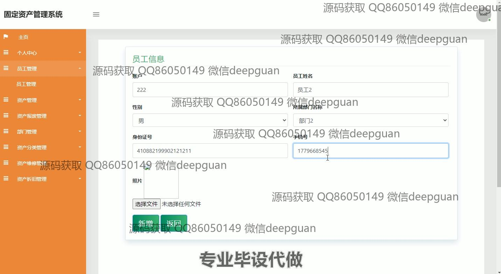
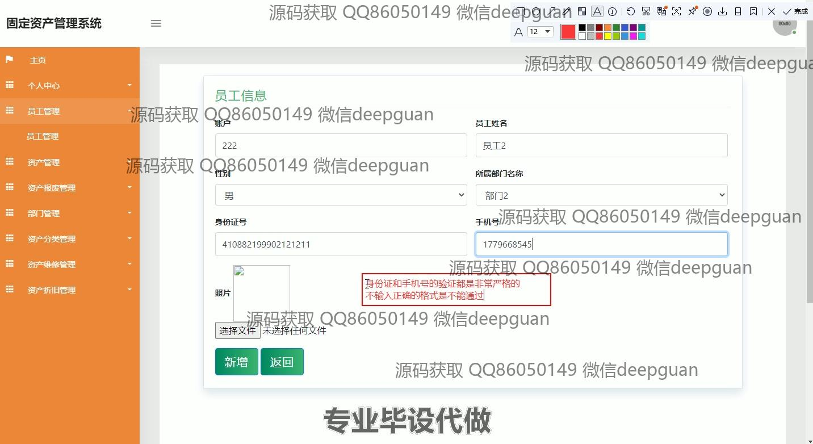

<h1 align="center">固定资产管理系统</h1>

## 简介
固定资产管理系统：角色分为管理员、用户；功能包括员工管理、资产管理、资产折旧管理、资产报废管理、部门管理与分类、信息录入与查询、密码修改与数据导出。    --计算机毕业设计源码；毕设源码；java毕业设计源码

## 联系方式

<h3 align="center">获取完整代码与数据库文件 + 微信：deepguan QQ: 86050149 QQ群: 783742310</h3>

<h3 align="center">可帮忙远程部署 包运行成功！提供远程部署、修改代码、设计文档指导、代码讲解等服务！</h3>

## 功能介绍（完整见运行截图）
管理员：主要负责系统的整体管理，包括固定资产的登记、查询、维护、报废管理、资产折旧计算等功能。管理员可以通过系统导航菜单快速访问各个管理模块，如个人中心、员工管理、部门管理、资产分类管理等。管理员可以进行员工信息录入与更新，包括员工账号、姓名、性别、身份证号及上传照片等细节。资产管理模块中，管理员可以查看资产列表、分类、进行资产的新增、查询、保养周期管理等操作，以确保公司资源的高效管理。

用户：用户可以通过个人中心查看和修改个人信息，包括登录密码的修改。用户能访问员工管理模块，输入和更新个人或部门内的员工详情信息，包括上传照片。除了个人信息，用户可以浏览和查询资产信息，通过输入资产名称、分类或部门过滤结果，还可以导出数据和生成报表。 在资产管理模块中，用户可以查看详细的资产信息，进行新增、修改或删除操作，在资产报废管理中处理过期或损坏的资产，以优化资源配置和使用。

## 运行截图

本代码来源于网络,仅供学习参考使用!

